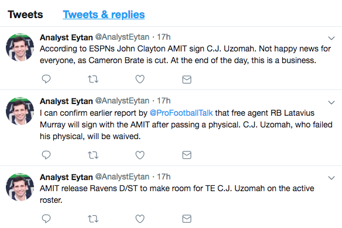

======
ff_bot
======

This bot tweets out fantasy football updates. Follow at @analysteytan

Instructions:
=============
1. Edit the files in the config directory to change twitter login settings, the abbreviations for the teams, the league settings and the sentence structure for the tweets.
2. Execute run_jobs.py and leave running:

::

    nohup python run_jobs.py &

This will look for new transactions every minute and tweet them out if there are any. It will also tweet game recaps early Tuesday mornings.

Notes:
======

Idea, design, sentence structure, twitter account and art courtesy of Josh Lurie.

Special thanks to Eytan Wallace for allowing us to use his likeness.